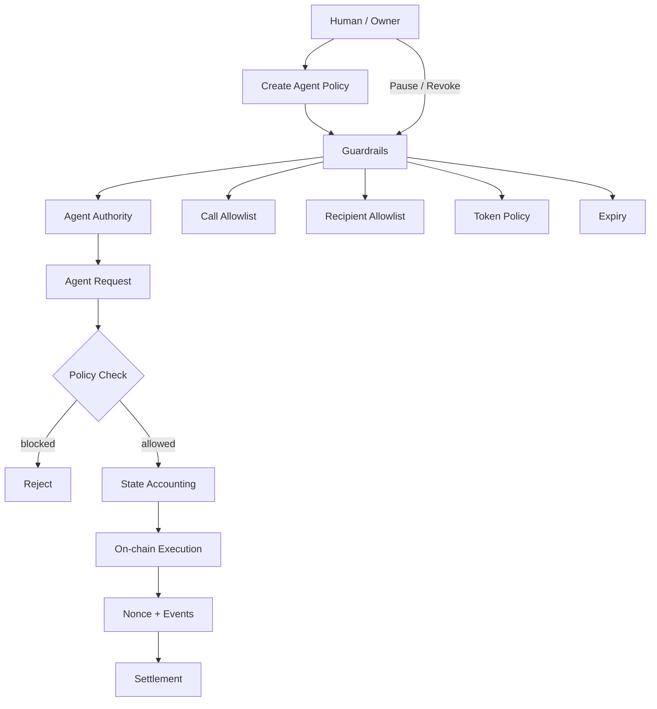
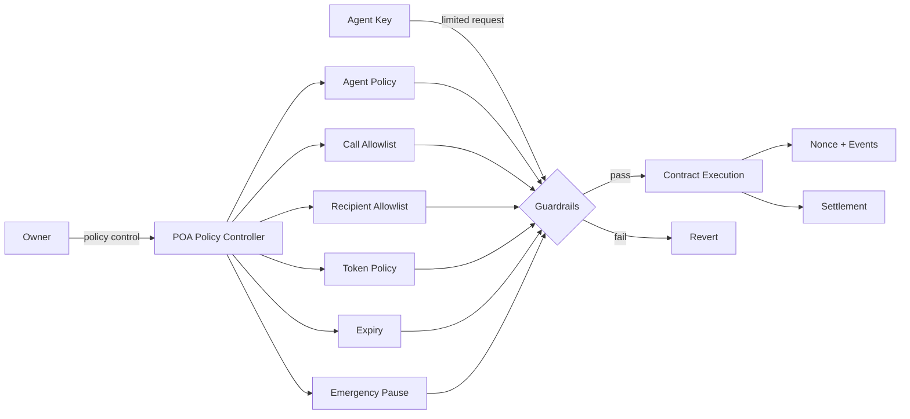

# POA --- Proof Of Action

<div align="center">

**Policy-Controlled Agentic Finance Infrastructure**

**Human intent → Policy → Agent execution → On-chain settlement → Audit**

</div>

---

## About

POA Agent Finance is a standalone smart-contract foundation for autonomous and AI-assisted finance.

The core principle is simple:

> **The agent may execute within a policy, but the agent never becomes the owner.**

The contract separates **human authority** from **agent execution authority**. Policies define what an agent can do, how much it can spend, where it can send funds, which contract functions it can call, and when its authority expires.

This repository is intentionally **standalone**. It is not coupled to PRONOUS, Flitzr, Binance, Privy, or another application.

---

## Core workflow



### Execution path

**Configure → Activate → Request → Validate → Account → Execute → Emit event**

1. Owner configures an agent.
2. Agent receives limited authority.
3. Agent submits an execution request.
4. Contract checks expiry, pause state, target, selector, recipient and spending limits.
5. Spending accounting is updated.
6. The approved call or token transfer executes.
7. Nonce and event data provide an on-chain execution trail.
8. Owner can pause or revoke authority at any time.

---

## Security architecture



### Security boundaries

| Layer | Responsibility |
|---|---|
| Owner | Creates, changes, pauses and revokes policies |
| Agent | Requests permitted execution only |
| Policy | Defines limits and permissions |
| Contract | Enforces policy deterministically |
| Nonce | Provides monotonic execution sequencing |
| Events | Provide an on-chain audit trail |
| Pause | Emergency global execution stop |
| Expiry | Automatic authority termination |
| Reentrancy guard | Prevents nested execution |

AI logic is **not trusted as a security boundary**. The smart contract remains the final enforcement layer.

---

## Project structure

```
poa_contracts/
├── contracts/
│   └── POAAgentFinance.sol       # Core policy + execution contract
│
├── test/
│   ├── POAAgentFinance.security.t.sol
│   │                              # Security regression tests
│   ├── POAAgentFinance.invariant.t.sol
│   │                              # State/invariant checks
│   └── POAAgentFinance.stateful.t.sol
│                                  # Stateful handler scenarios
│
├── script/                        # Deployment scripts
├── foundry.toml                   # Foundry compiler/test configuration
├── README.md                      # Architecture + usage overview
└── ARCHITECTURE.md                # Detailed system design
```

The repository keeps the **security-critical policy layer small and isolated**. Application-specific agents, APIs, wallets and protocol adapters can be built above it later without changing the core security model.

---

## Policy model

### Native assets

Each agent receives:

- maximum policy duration: **30 days**
- total native spending cap
- per-transaction native limit
- active / revoked state

### ERC-20 assets

Each agent/token pair can define:

- cumulative token cap
- per-transaction token limit
- cumulative spending accounting

### Contract calls

Calls require an explicit:

**agent + target + function selector**

allowlist entry.

### Token recipients

Token transfers require an explicit:

**agent + recipient**

allowlist entry.

---

## Owner lifecycle

```
Create Policy
     ↓
Activate Agent
     ↓
Agent Executes
     ↓
 ┌───────────────┐
 │ Active Policy │
 └───────────────┘
     ↓
  Pause / Revoke / Expire
     ↓
Authority Ends
```

The owner remains the root authority throughout the lifecycle.

---

## Agent execution lifecycle

```
Agent
  │
  ▼
Request
  │
  ▼
Is active?
  │ no ─────► Revert
  │ yes
  ▼
Is paused?
  │ yes ────► Revert
  │ no
  ▼
Policy validation
  │
  ├── expiry
  ├── target + selector
  ├── recipient
  ├── per-tx limit
  └── cumulative cap
  │
  ▼
Accounting
  │
  ▼
On-chain call
  │
  ▼
Nonce + event
  │
  ▼
Settlement
```

---

## Security status

Current defenses include:

- two-step ownership transfer
- agent expiry
- native spending caps
- native per-transaction limits
- ERC-20 spending caps
- ERC-20 per-transaction limits
- target/function-selector allowlisting
- recipient allowlisting
- emergency pause
- monotonic nonce
- reentrancy protection
- defensive ERC-20 transfer handling
- policy validation
- security regression tests
- invariant/stateful test scaffolding

This repository has **not been independently audited**. Passing local or CI tests does not constitute a security audit. Production funds should not be deployed until independent review, fuzzing, static analysis and deployment validation are complete.

---

## Development

```bash
forge build
forge test
```

The intended development loop is:

**Change → Build → Security tests → Invariant/stateful tests → Review → Deploy**

---

## Future application layer

The core contract intentionally does not contain protocol-specific logic.

A future application can sit above it:

```
User / AI Agent
      │
      ▼
Application / API
      │
      ▼
Policy Builder
      │
      ▼
POAAgentFinance
      │
      ├── DEX
      ├── Lending
      ├── Payments
      └── Other protocols
```

This keeps integrations replaceable while the security boundary remains centralized in the POA contract.

---

<div align="center">

**Policy first. Agent second. Settlement last.**

</div>
